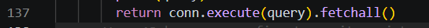
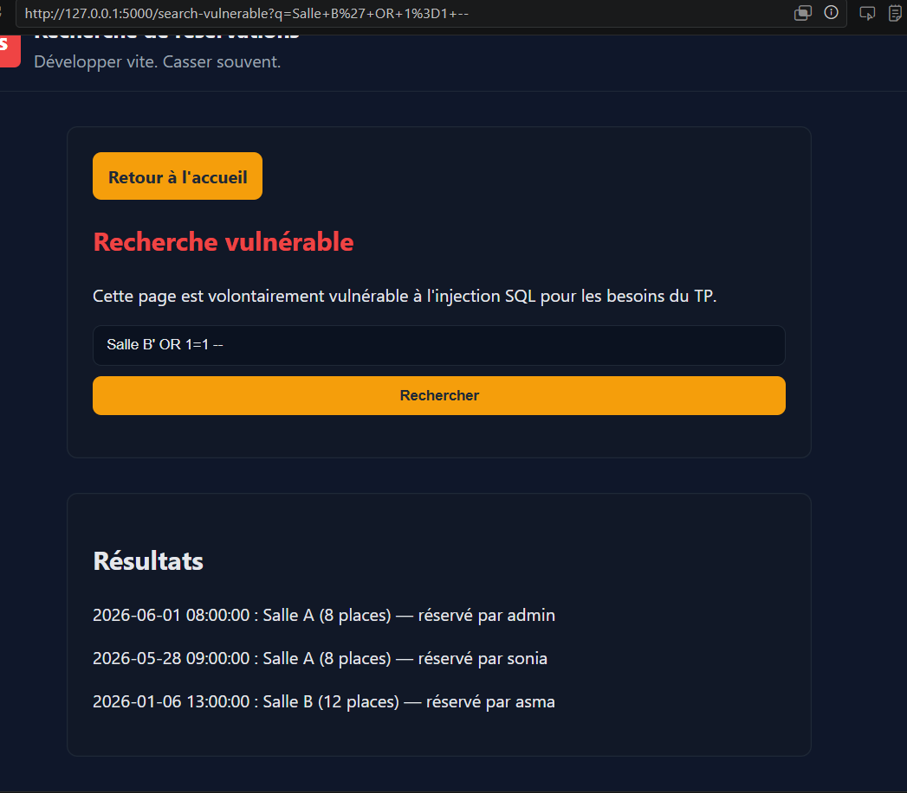
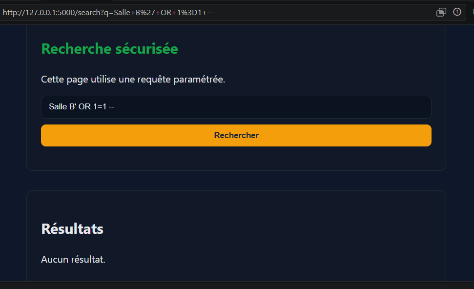
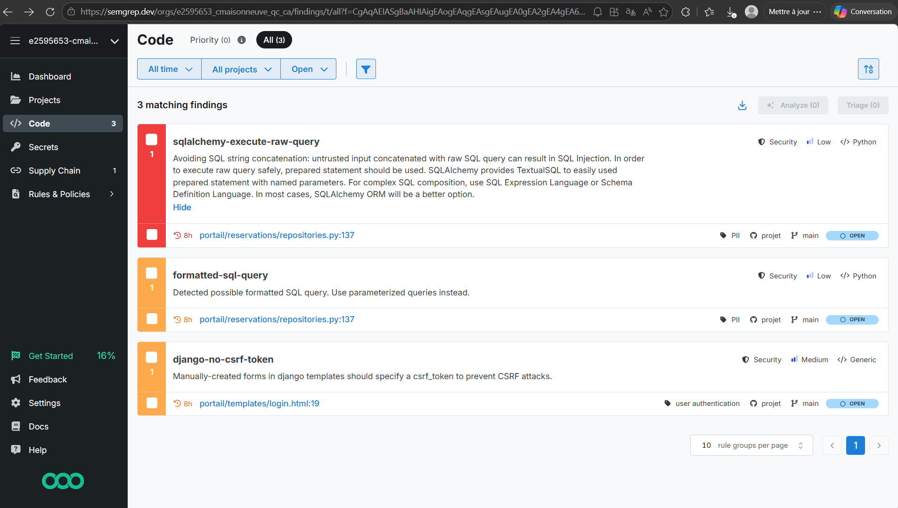
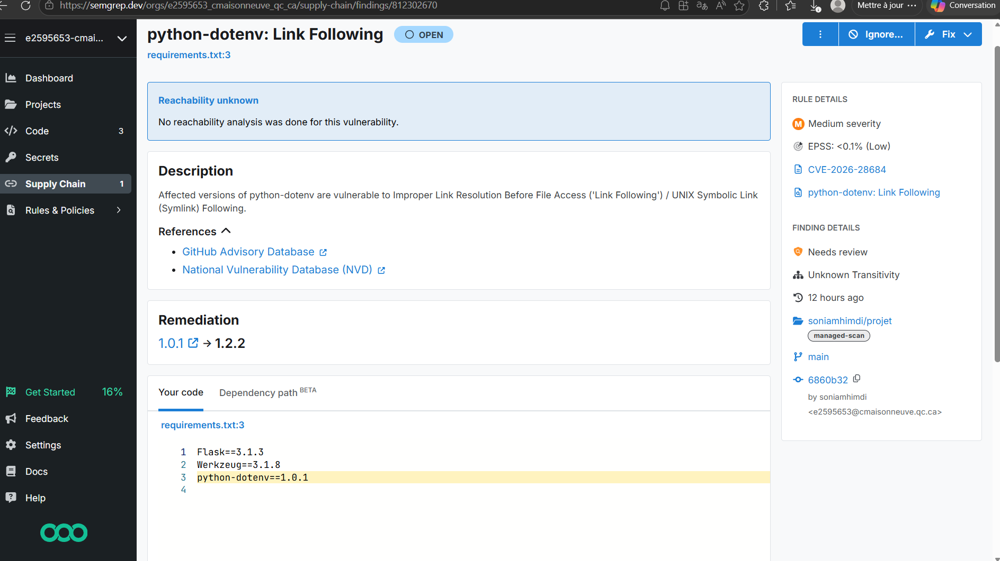

# 🔎 **Analyse du rapport SAST (Semgrep)**

L’analyse SAST réalisée avec Semgrep a permis d’identifier **trois alertes de sécurité** dans le projet. Elles concernent principalement des risques d’injection SQL et une mauvaise protection contre les attaques CSRF. Les résultats sont détaillés ci‑dessous.

---
## vulnerabilite implementé detectée : injection SQL
## 1. ⚠️ Risque d’injection SQL — *portail/reservations/repositories.py* (ligne 137)

Deux règles Semgrep distinctes signalent la même zone de code :

- **python.lang.security.audit.formatted-sql-query**  
- **python.sqlalchemy.security.sqlalchemy-execute-raw-query**

### **Constat**

Le code construit une requête SQL de manière dynamique, ce qui peut permettre à un utilisateur malveillant d’injecter du SQL arbitraire.  
Semgrep associe ce problème à :

- **OWASP Top 10 : A01/A03/A05 – Injection**  
- **CWE‑89 : SQL Injection**  
- Impact : **Élevé**  
- Probabilité : **Faible**, mais **danger critique** si exploité

### **Cause**

La requête SQL semble être construite via une concaténation ou un formatage de chaîne, au lieu d’utiliser des paramètres préparés.

### **Recommandation**

Utiliser systématiquement des requêtes paramétrées, par exemple :

```python
cursor.execute("SELECT * FROM reservations WHERE user_id = ?", (user_id,))
```

ou, si SQLAlchemy est utilisé, employer **TextualSQL** avec paramètres nommés.

---

## 2. ⚠️ Absence de protection CSRF — *portail/templates/login.html*

Règle déclenchée :  
**python.django.security.django-no-csrf-token**

### **Constat**

Le formulaire HTML ne contient pas de jeton CSRF.  
Même si le projet utilise Flask (et non Django), Semgrep détecte ici un **formulaire non protégé**, ce qui reste pertinent.

### **Risque**

- **CWE‑352 : Cross-Site Request Forgery (CSRF)**  
- Un attaquant pourrait forcer un utilisateur authentifié à exécuter une action à son insu.

### **Recommandation**

Ajouter une protection CSRF côté Flask, par exemple via :

- `Flask-WTF` et `{{ form.csrf_token }}`  
- Ou un middleware CSRF personnalisé

---

## 3. ⚠️ Erreur de parsing — *rapport_sast.json*

Semgrep signale une erreur :

---

# ✅ **Synthèse générale**

| Problème | Gravité | Impact | Correction recommandée |
|---------|---------|--------|-------------------------|
| Injection SQL (ligne 137) | **Élevée** | Compromission totale de la base | Utiliser des requêtes paramétrées |
| Formulaire sans CSRF | **Moyenne** | Actions non autorisées | Ajouter un jeton CSRF |
| Fichier JSON invalide | Faible | Perturbation des outils | Corriger ou supprimer |


---

# 🛠️ **Conclusion**

Le rapport SAST met en évidence deux vulnérabilités importantes :

1. **Un risque d’injection SQL**, classé critique selon OWASP et CWE.  
2. **L’absence de protection CSRF** sur un formulaire sensible.

Ces failles doivent être corrigées en priorité pour garantir l’intégrité et la sécurité du portail de réservation. Les recommandations proposées permettent de renforcer efficacement la sécurité du projet.

# **Écrans montrant la vulnérabilité testée et le rapport Semgrep.dev**





